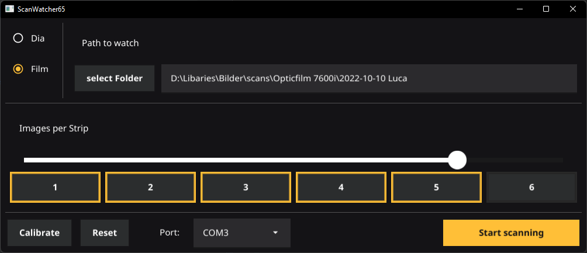

# Auto Film Scanner
This project is a mod to the Plustec Opticfilm film scanner series, to automate the inserting of the film holder

## How Does It Work
The system has two parts. 
1. the mechanics that move the film holder,
2. a software that watches the output folder of the scanning software to tell the mechanics when to move the gantry.

after the new film frame is moved into the scanner, this software sends a keyboard shortcut to the scanning software
to initialize the next scan

## Downlaod
[Download For Windows](https://github.com/gertminov/autoFilmScanner/releases/tag/0.1.0)

