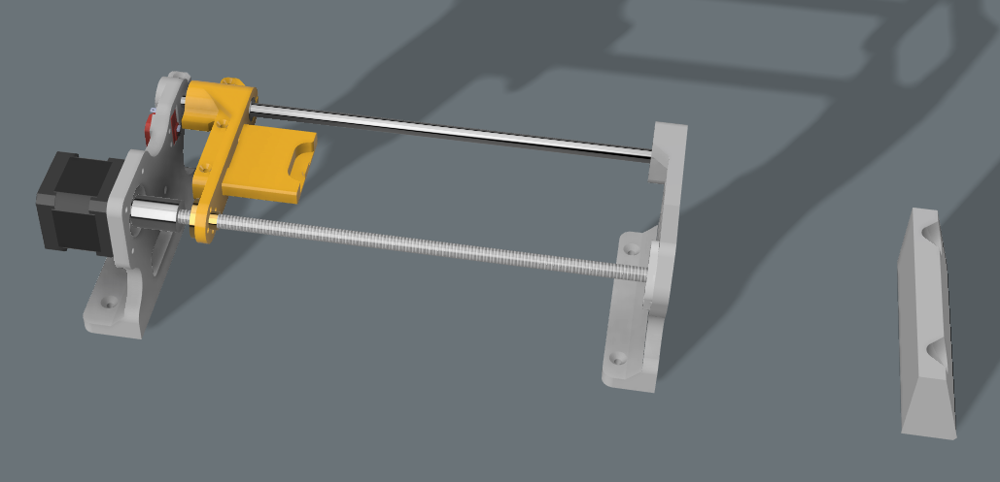
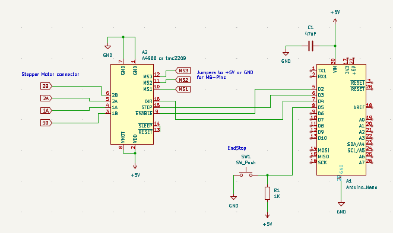

# Auto Film Scanner
This project is a mod to the Plustec Opticfilm film scanner series, to automate the inserting of the film holder

## How Does It Work
The system has three parts. 
1. the mechanics that move the film holder using a 3d printed gantry system including a nema stepper motor
2. an Arduino Nano + stepperdriver (A4988 or tmc2209) which comunicates over Serial with the software and controlls the mechanics
3. a software that watches the output folder of the scanning software to tell the mechanics when to move the gantry.

after the new film frame is moved into the scanner, this software sends a keyboard shortcut to the scanning software
to initialize the next scan

## Mechanics
Note: The design for the mechanics would probably work better, if it was redesigned using two liniear rods on the sides and maybe a belt/pully solution to move the gantry.

Parts List:
+ 1x 300mm linear rod (8mm radius)
+ 1x LM8UU linear bearing
+ 1x 270mm leadscrew + nut
+ 1x KFL08 bearing
+ 1x Endstop switch
+ A few M3,M5 and two M2 screws and nuts.

The 3D printed parts from the modell are requiered, as well as a wooden board or something similar to mount the mechanism to.

## Schematic

The Board uses a 5V Powersupply and should be connected via USB so the software can talk to the Arduino through Serial.

To drive the Nema17 steppermotor an A4988 stepperdriver or a TMC2209 can be used.
The TMC2209 is a bit more expensive but allows the use of the StealthChop mode, which makes the stepper motor run much more quiet.

#### Stepperdriver config
For the **A4988** the MS1-3 Pins are used to set the amout of microsteps per fullstep as follows:
| MS1  | MS2  | MS3  | Steps     |
| ---- | ---- | ---- | -------------- |
| Low  | Low  | Low  | Full step      |
| High | Low  | Low  | 1/2 step      |
| Low  | High | Low  | 1/4 step    |
| High | High | Low  | 1/8 step     |
| High | High | High | 1/16 step |

Using more than a full step requiers to increase the stepcount in the programm accordingly and the delay between steps lowerd.
Microstepping is not necessary, since the precision using fulls steps is enough here.

For the **TMC2209** the MS3 pin is called *spread* and should be connected to GND to enable stealthchop mode
| MS1  | MS2  | Steps     |
| ---- | ---- | -------------- |
| Low  | Low  | 1/8 step     |
| High | High | 1/16 step |
| High | Low  | 1/32 step      |
| Low  | High | 1/64 step      |

Since the lowest is 1/8 steps, (so 8 microsteps to make 1 full step) all stepcounts in the programm have to be multiplied by 8 and the delay between steps could be lowerd or the gantry will move 8 times slower.

## Download
[Download For Windows](https://github.com/gertminov/autoFilmScanner/releases/tag/0.1.0)

